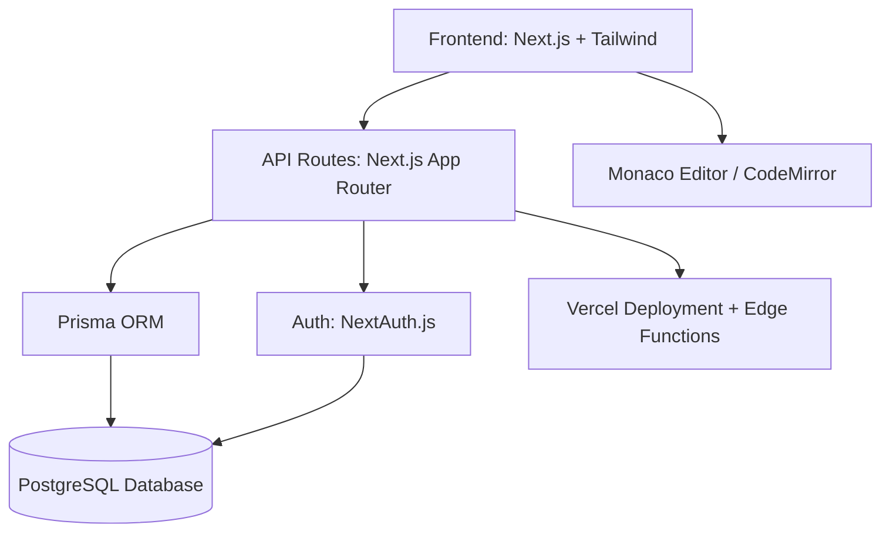

# 🧠 LetBroExplain  
> *“Because sometimes you don’t need a textbook — you need a bro who gets it.”*  

  
  
  
  
  
  
  
  

---

## 🏗️ Project Overview  

**LetBroExplain** is a developer-first learning platform that teaches **DSA**, **Computer Science**, and **Programming Fundamentals** — but in a **funny, relatable, and non-boring** way.  
We ditch the textbook tone and explain concepts the way your coding buddy would: with memes, analogies, and jokes that *actually stick*.  

💬 *Laugh first, learn second — retain forever.*  

---

## 🚀 Features  

### 👨‍💻 For Learners
- 🧩 **Concepts Simplified** — DSA, OS, DBMS, CN, and more explained like stories, not specs.  
- 📚 **Topic Navigation** — Clean sidebar for categories and subtopics.  
- 💻 **Online Compiler** — Run code examples live (supports C++, Python, JavaScript).  
- 🔍 **Search Everything** — Instantly find articles or code snippets.  
- 🌓 **Dark/Light Mode** — For your eyes and your vibe.  

### 🧑‍🏫 For Admin (You!)
- ✏️ **Admin Dashboard** — Write, edit, and publish articles.  
- 🔐 **Authentication** — Only the admin (you) can log in.  
- 📝 **Draft & Publish System** — Save drafts, publish when ready.  
- 🧠 **Markdown Editor** — Write beautifully formatted, syntax-highlighted content.  

---

## 🧰 Tech Stack  

| Layer | Technology |
|:------|:------------|
| **Framework** | [Next.js 15 (App Router)](https://nextjs.org/) |
| **Language** | [TypeScript](https://www.typescriptlang.org/) |
| **Styling** | [TailwindCSS](https://tailwindcss.com/) + [shadcn/ui](https://ui.shadcn.com/) |
| **Database** | [PostgreSQL](https://www.postgresql.org/) via [Prisma ORM](https://www.prisma.io/) |
| **Authentication** | [NextAuth.js](https://next-auth.js.org/) |
| **Compiler** | Monaco Editor / CodeMirror + backend execution API |
| **Deployment** | [Vercel](https://vercel.com/) |
| **Linting & Formatting** | Biome / ESLint + Prettier |
| **Animations** | [Framer Motion](https://www.framer.com/motion/) |

---

## 🧱 Project Structure  

```bash
letbroexplain/
├── app/
│   ├── (public)/          # Home, Topics, About pages
│   ├── (admin)/           # Admin dashboard (protected)
│   ├── api/               # Auth, Compiler, Articles
│   ├── layout.tsx
│   └── page.tsx
├── components/            # Shared UI components (Navbar, Sidebar, etc.)
├── lib/                   # Utilities (auth, db, helpers)
├── prisma/                # Prisma schema and migrations
├── public/                # Images, logos, static assets
├── styles/                # Global CSS
└── README.md
````

---

## 🧮 Architecture



---

## 🔒 Logging & Security

* **NextAuth.js** for secure JWT sessions
* **Rate limiting** on API routes
* **CSRF Protection** via built-in NextAuth middleware
* **Sensitive environment variables** stored in `.env.local`
* **Server logs** via Vercel Analytics or custom middleware

---

## ⚙️ CI/CD Setup

* ✅ **Automatic Deploys** on push to `main` branch (Vercel)
* 🧪 **Preview Deployments** for pull requests
* 🔍 **Lint & Type Checks** before deployment
* 🧰 **GitHub Actions** optional for extended tests or custom builds

---

## 🧑‍💻 Local Development

```bash
# 1️⃣ Clone the repository
git clone https://github.com/yourusername/letbroexplain.git
cd letbroexplain

# 2️⃣ Install dependencies
npm install

# 3️⃣ Setup environment variables
cp .env.example .env.local

# 4️⃣ Run the dev server
npm run dev
```

Your app will be live at 👉 `http://localhost:3000`

---

## 🪄 Future Roadmap

* 🧠 AI-Powered “Bro” Chat — ask coding questions, get fun explanations
* 📊 User Analytics (Most viewed topics)
* 💬 Comment System for users
* 🪶 Newsletter for weekly “BroNotes”

---

## 💚 Credits

Built with ❤️ by **Sanskar Srivastava**

> Motto: *We make you laugh before we make you learn.*
